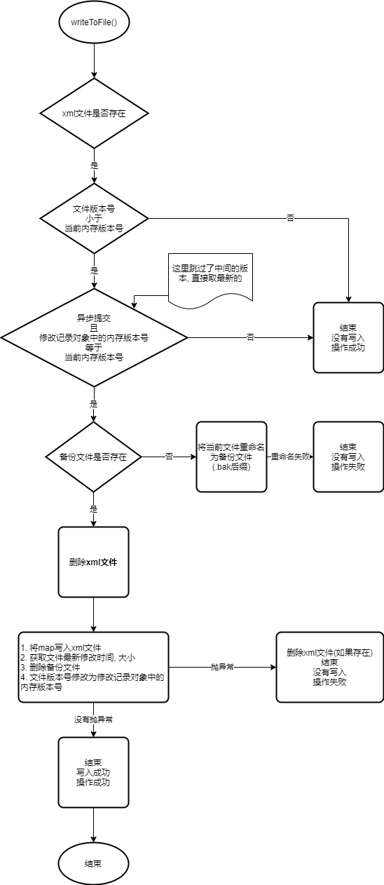
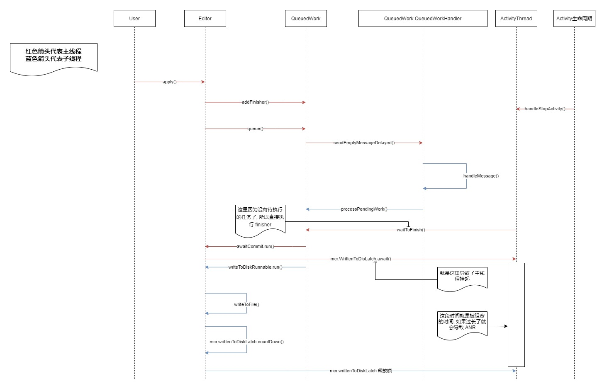

# SharedPreferences

_Android: 11, api:30_

___

## SharedPreferences 对象

### 文件位置

`{dataDir}/shared_prefs/{name}.xml`

### 获取对象

```java
    /**
     * ContextImpl
     */
    @Override
    public SharedPreferences getSharedPreferences(File file, int mode) {
        SharedPreferencesImpl sp;
        synchronized (ContextImpl.class) {
            //这里返回的是一个静态的缓存, 所以app中, 某个文件只会存在一个对应的sp对象
            final ArrayMap<File, SharedPreferencesImpl> cache = getSharedPreferencesCacheLocked();
            sp = cache.get(file);
            if (sp == null) {
                //判断 mode 是否合法, 在 targetSdkVersion >= N 时, MODE_WORLD_READABLE 和 MODE_WORLD_WRITEABLE 都已经被废弃, 如果使用会抛异常
                checkMode(mode);
                if (getApplicationInfo().targetSdkVersion >= android.os.Build.VERSION_CODES.O) {
                    //... 文件加密相关
                }
                sp = new SharedPreferencesImpl(file, mode);
                cache.put(file, sp);
                return sp;
            }
        }
        if ((mode & Context.MODE_MULTI_PROCESS) != 0 ||
            getApplicationInfo().targetSdkVersion < android.os.Build.VERSION_CODES.HONEYCOMB) {
            // If somebody else (some other process) changed the prefs
            // file behind our back, we reload it.  This has been the
            // historical (if undocumented) behavior.
            //多进程 或者 < H 情况下 每次拿到sp都需要去判断文件有没有被其它进程等修改过, 如果修改过, 则重新加载
            sp.startReloadIfChangedUnexpectedly();
        }
        return sp;
    }
```

从源码可知

1. 某个文件只会存在一个对应的sp对象

2. 在 targetSdkVersion >= N 时, MODE_WORLD_READABLE 和 MODE_WORLD_WRITEABLE 都已经被废弃, 如果使用会抛异常

3. 文件加密相关资料: [文件级加密](https://source.android.com/security/encryption/file-based), [支持“直接启动”模式](https://developer.android.com/training/articles/direct-boot)

4. 多进程 或者 Android < H 情况下 每次拿到sp都需要去判断文件有没有被其它进程等修改过, 如果修改过, 则重新加载

### mode

1. MODE_PRIVATE: 默认的私有模式, 只有自己和具有相同 sharedUserId 的引用能读写. [sharedUserId资料](https://juejin.cn/post/6844903704332599310)

2. MODE_WORLD_READABLE: 允许所有应用读取, >= N 时, 如果使用这个会抛异常

3. MODE_WORLD_WRITEABLE: 允许所有应用读取和写入, >= N 时, 如果使用这个会抛异常

4. MODE_MULTI_PROCESS: 多进程标志, 不推荐使用, 每次调用 `Context.getSharedPreferences()` 都会去获取文件的最后修改时间和大小来判断有没有被修改, 被修改了就需要重新从文件加载到内存.

## 加载文件

`loadFromDisk()` 函数在名为 "SharedPreferencesImpl-load" 的子线程中被调用

```java
    //这个在子线程中
    private void loadFromDisk() {
        synchronized (mLock) {
            if (mLoaded) {
                return;
            }
            //如果备份文件存在, 则将备份文件作为主文件
            if (mBackupFile.exists()) {
                mFile.delete();
                mBackupFile.renameTo(mFile);
            }
        }

        // ... 省略一些代码
        // ... 获取文件状态
        // ... 解析xml文件

        synchronized (mLock) {
            mLoaded = true;
            mThrowable = thrown;

            try {
                if (thrown == null) {
                    if (map != null) {
                        mMap = map;
                        mStatTimestamp = stat.st_mtim;
                        mStatSize = stat.st_size;
                    } else {
                        mMap = new HashMap<>();
                    }
                }
                // In case of a thrown exception, we retain the old map. That allows
                // any open editors to commit and store updates.
            } catch (Throwable t) {
                //加载过程中的异常, 存起来在读取时到主线程(也有可能是其他线程)抛出
                mThrowable = t;
            } finally {
                //在读取时如果文件未加载到内存, 调用者线程会进入等待状态, 这里将他们唤醒
                mLock.notifyAll();
            }
        }
    }
```

> 拓展知识 [lstat, fstat, stat](https://stackoverflow.com/questions/32895019/difference-between-lstat-fstat-and-stat-in-c), [BlockGuard](https://duanqz.github.io/2015-11-04-StrictMode-Analysis)

## 读取

```java
    //其他读取都类似, 这边随便拿一个
    @Override
    public Map<String, ?> getAll() {
        synchronized (mLock) {
            //利用锁来等待文件加载完毕
            awaitLoadedLocked();
            //noinspection unchecked
            return new HashMap<String, Object>(mMap);
        }
    }

    @GuardedBy("mLock")
    private void awaitLoadedLocked() {
        while (!mLoaded) {
            try {
                //未加载完成, 释放锁, 进入等待状态
                mLock.wait();
            } catch (InterruptedException unused) {
            }
        }

        if (mThrowable != null) {
            throw new IllegalStateException(mThrowable);
        }
    }
```

## 写入

```java
    @Override
    public Editor edit() {
        // Android 团队准备将这个锁去掉, 使其在加载时也可以写入
        // TODO: remove the need to call awaitLoadedLocked() when
        // requesting an editor.  will require some work on the
        // Editor, but then we should be able to do:
        //
        //      context.getSharedPreferences(..).edit().putString(..).apply()
        //
        // ... all without blocking.
        // 这边也等待加载完成
        synchronized (mLock) {
            awaitLoadedLocked();
        }

        return new EditorImpl();
    }

    public final class EditorImpl implements Editor {
        private final Object mEditorLock = new Object();

        @GuardedBy("mEditorLock")
        private final Map<String, Object> mModified = new HashMap<>();

        //是否调用了 clear()
        @GuardedBy("mEditorLock")
        private boolean mClear = false;

        //put都差不多, 将 key, value 放到map里

        @Override
        public Editor remove(String key) {
            synchronized (mEditorLock) {
                //remove 不直接调用 remove, 否则就不知道哪个要删了
                mModified.put(key, this);
                return this;
            }
        }
    }
```

### commitToMemory()

将改动的key等打包到一个 `MemoryCommitResult` 对象中, 方便后面调用 `commit()` 以及 `apply()`

```java
    // EditorImpl
    // Returns true if any changes were made
    private MemoryCommitResult commitToMemory() {
        long memoryStateGeneration;
        boolean keysCleared = false;
        List<String> keysModified = null;
        Set<OnSharedPreferenceChangeListener> listeners = null;
        Map<String, Object> mapToWriteToDisk;
        synchronized (SharedPreferencesImpl.this.mLock) {
            if (mDiskWritesInFlight > 0) {
                // 正在写入磁盘, 那么拿一个拷贝
                mMap = new HashMap<String, Object>(mMap);
            }
            mapToWriteToDisk = mMap;
            mDiskWritesInFlight++;
            boolean hasListeners = mListeners.size() > 0;
            if (hasListeners) {
                keysModified = new ArrayList<String>();
                listeners = new HashSet<OnSharedPreferenceChangeListener>(mListeners.keySet());
            }
            synchronized (mEditorLock) {
                boolean changesMade = false;
                if (mClear) {
                    //清空
                    if (!mapToWriteToDisk.isEmpty()) {
                        changesMade = true;
                        mapToWriteToDisk.clear();
                    }
                    keysCleared = true;
                    mClear = false;
                }
                for (Map.Entry<String, Object> e : mModified.entrySet()) {
                    String k = e.getKey();
                    Object v = e.getValue();
                    // value == this 和 value == null 结果上是相等的, 不过可以用来记录行为, this 为 remove, null 为 用户设置为空
                    if (v == this || v == null) {
                        if (!mapToWriteToDisk.containsKey(k)) {
                            continue;
                        }
                        mapToWriteToDisk.remove(k);
                    } else {
                        if (mapToWriteToDisk.containsKey(k)) {
                            Object existingValue = mapToWriteToDisk.get(k);
                            if (existingValue != null && existingValue.equals(v)) {
                                continue;
                            }
                        }
                        mapToWriteToDisk.put(k, v);
                    }
                    changesMade = true;
                    if (hasListeners) {
                        keysModified.add(k);
                    }
                }
                mModified.clear();
                if (changesMade) {
                    //记录修改的一个版本号(内存中)
                    mCurrentMemoryStateGeneration++;
                }
                memoryStateGeneration = mCurrentMemoryStateGeneration;
            }
        }
        return new MemoryCommitResult(memoryStateGeneration, keysCleared, keysModified,
                listeners, mapToWriteToDisk);
    }
```

### apply()

异步将改动写入到文件, 也有可能会导致 ANR, 具体原因后面会解释

```java
    @Override
    public void apply() {
        final long startTime = System.currentTimeMillis();
        final MemoryCommitResult mcr = commitToMemory();
        final Runnable awaitCommit = new Runnable() {
                @Override
                public void run() {
                    try {
                        //CountDownLatch, 数量为1, 阻塞等待
                        mcr.writtenToDiskLatch.await();
                    } catch (InterruptedException ignored) {
                    }
                    if (DEBUG && mcr.wasWritten) {
                        Log.d(TAG, mFile.getName() + ":" + mcr.memoryStateGeneration
                                + " applied after " + (System.currentTimeMillis() - startTime)
                                + " ms");
                    }
                }
            };
        //QueuedWork 见后面详解
        //导致 ANR 的原因
        QueuedWork.addFinisher(awaitCommit);
        Runnable postWriteRunnable = new Runnable() {
                @Override
                public void run() {
                    //这里为什么还要再调用一下? 不是肯定不会进入等待状态嘛? 难道是因为 commit() 不走 QueuedWork, 然后这里想输出一下日志?
                    awaitCommit.run();
                    QueuedWork.removeFinisher(awaitCommit);
                }
            };
        //将改动记录 写入到文件中
        SharedPreferencesImpl.this.enqueueDiskWrite(mcr, postWriteRunnable);
        //发送改动通知
        notifyListeners(mcr);
    }
```

### commit()

同步将改动写入到文件

```java
    @Override
    public boolean commit() {
        long startTime = 0;
        if (DEBUG) {
            startTime = System.currentTimeMillis();
        }
        MemoryCommitResult mcr = commitToMemory();
        //第二个参数传入null, 说明是同步调用
        SharedPreferencesImpl.this.enqueueDiskWrite(mcr, null);
        try {
            //阻塞
            mcr.writtenToDiskLatch.await();
        } catch (InterruptedException e) {
            return false;
        } finally {
            if (DEBUG) {
                Log.d(TAG, mFile.getName() + ":" + mcr.memoryStateGeneration
                        + " committed after " + (System.currentTimeMillis() - startTime)
                        + " ms");
            }
        }
        notifyListeners(mcr);
        return mcr.writeToDiskResult;
    }
```

### enqueueDiskWrite()

将写入文件的任务 直接在当前线程执行 或者 放入 `QueuedWork` 队列中

```java
    private void enqueueDiskWrite(final MemoryCommitResult mcr,
                                  final Runnable postWriteRunnable) {
        //是否是同步操作
        final boolean isFromSyncCommit = (postWriteRunnable == null);
        final Runnable writeToDiskRunnable = new Runnable() {
                @Override
                public void run() {
                    synchronized (mWritingToDiskLock) {
                        //写入到文件, 代码太多就不上了, 长见图
                        writeToFile(mcr, isFromSyncCommit);
                    }
                    synchronized (mLock) {
                        mDiskWritesInFlight--;
                    }
                    if (postWriteRunnable != null) {
                        postWriteRunnable.run();
                    }
                }
            };

        // Typical #commit() path with fewer allocations, doing a write on
        // the current thread.
        if (isFromSyncCommit) {
            boolean wasEmpty = false;
            synchronized (mLock) {
                //因为 commitToMemory() 进行了++, 所以如果是1, 说明只有该提交准备写入文件, 直接run(); 否则等待(通过放入 QueuedWork)其他任务(只能是异步任务)完成, 再进行写入
                wasEmpty = mDiskWritesInFlight == 1;
            }
            if (wasEmpty) {
                writeToDiskRunnable.run();
                return;
            }
        }

        QueuedWork.queue(writeToDiskRunnable, !isFromSyncCommit);
    }
```

见源码可得:

1. (来自源码注释)If another editor on this SharedPreferences does a regular commit() while a apply() is still outstanding, the commit() will block until all async commits are completed as well as the commit itself. 如果当 `apply()` 还在执行的时候, 又调用了 `commit()`, 此 `commit()` 会被阻塞, 直到 `apply()` 完成

### writeToFile()

将数据写入到文件中



## SharedPreferencesImpl 中的锁

1. `mLock`:读锁, 依赖该锁的对象有:

    ```java
    @GuardedBy("mLock")
    private Map<String, Object> mMap;
    @GuardedBy("mLock")
    private Throwable mThrowable;

    @GuardedBy("mLock")
    private int mDiskWritesInFlight = 0;

    @GuardedBy("mLock")
    private boolean mLoaded = false;

    @GuardedBy("mLock")
    private StructTimespec mStatTimestamp;

    @GuardedBy("mLock")
    private long mStatSize;

    @GuardedBy("mLock")
    private final WeakHashMap<OnSharedPreferenceChangeListener, Object> mListeners =
            new WeakHashMap<OnSharedPreferenceChangeListener, Object>();
    ```

2. `mWritingToDiskLock`:文件写锁, 依赖该锁的对象有:

    ```java
    /** Latest memory state that was committed to disk */
    @GuardedBy("mWritingToDiskLock")
    private long mDiskStateGeneration;

    /** Time (and number of instances) of file-system sync requests */
    @GuardedBy("mWritingToDiskLock")
    private final ExponentiallyBucketedHistogram mSyncTimes = new ExponentiallyBucketedHistogram(16);
    ```

3. `SharedPreferencesImpl.this`: 好像没有在源码里看到过获取该锁, 下面这个对象都是被读锁+写锁(任一)包裹着, 依赖该锁的对象有:

    ```java
    /** Current memory state (always increasing) */
    @GuardedBy("this")
    private long mCurrentMemoryStateGeneration;
    ```

4. `EditorImpl.mEditorLock`: 内存写锁, 确保并发调用 putxxx, clear 等的线程安全性, 依赖该锁的对象有:

    ```java
    @GuardedBy("mEditorLock")
    private final Map<String, Object> mModified = new HashMap<>();

    @GuardedBy("mEditorLock")
    private boolean mClear = false;
    ```

5. `MemoryCommitResult.writtenToDiskLatch`: 这个也算一个吧, 主要是等待文件写入完成

## QueuedWork

异步(主线程或者子线程都有可能, 看调用的是哪个方法)执行任务的队列, 可以通过 `queue()` 添加work任务, 通过 `addFinisher()` 添加 finisher 任务

finisher 任务**只会在 `waitToFinish()` 被调用后 且 work 任务执行完之后才会依次执行(当然有可能任务在子线程执行了, 这里就没有待执行的任务了, 就直接执行 finisher 了)**

### `processPendingWork()` 调用时机

这个方法是执行 work 任务的

1. `waitToFinish()` 时, 此时 任务执行完了 会去执行 finisher, 在主线程

    1. `ActivityThread.handleServiceArgs()`: `Service.onStartCommand()` / `Service.onTaskRemoved()` 执行后

    2. `ActivityThread.handleStopService()`: `Service.onDestroy()` 执行后

    3. `ActivityThread.handlePauseActivity()` (target version H 前): `Activity.onPause()` 执行后

    4. `ActivityThread.handleStopActivity()` (target version H 及之后): `Activity.onStop()` 执行后

2. `queue()` 时, 不会执行 finisher, 在子线程

    1. `SharedPreferencesImpl.enqueueDiskWrite()`

    2. `BroadcastReceiver.PendingResult.finish()`

    ```java
    public static void queue(Runnable work, boolean shouldDelay) {
        Handler handler = getHandler();

        synchronized (sLock) {
            sWork.add(work);

            if (shouldDelay && sCanDelay) {
                //sCanDelay 当前没有在执行work或finisher
                //可以延迟, 默认延迟100ms再发消息
                handler.sendEmptyMessageDelayed(QueuedWorkHandler.MSG_RUN, DELAY);
            } else {
                //直接发消息
                handler.sendEmptyMessage(QueuedWorkHandler.MSG_RUN);
            }
        }
    }

    //QueuedWorkHandler
    public void handleMessage(Message msg) {
        if (msg.what == MSG_RUN) {
            processPendingWork();
        }
    }
    ```

## ANR 的原因

主要原因都是写入文件时太耗时

1. `commit()`, 这个不用讲, 因为在主线程同步执行的

2. `apply()`, 异步执行(不确保是在哪个线程), 却还是会导致 ANR

    1. `QueuedWork.waitToFinish()` -> `QueuedWork.processPendingWork()`: 在主线程执行, 阻塞是正常的

    2. `QueuedWork.QueuedWorkHandler.handleMessage()` -> `QueuedWork.processPendingWork()`: 在子线程执行, 阻塞是因为添加了一个等待写入完成的 finisher (`mcr.writtenToDiskLatch.await()`),  子线程执行写入任务后, 主线程调用了 `QueuedWork.waitToFinish()`, 因为这时候没有待执行的任务了(都在子线程的局部变量里了, 详情可见源码), 所以直接执行 finisher, 即进行阻塞等待, 直到写入文件成功后恢复执行, 这时候如果等待时间过长就会导致anr. 长见图 (因为有两个线程, 所以用箭头颜色区分了一下线程): 

## 进程安全性

毫无疑问肯定是进程不安全的, 解决方法如下:

1. 搭配 `ContentProvider`

2. 加个文件锁 `FileLock`