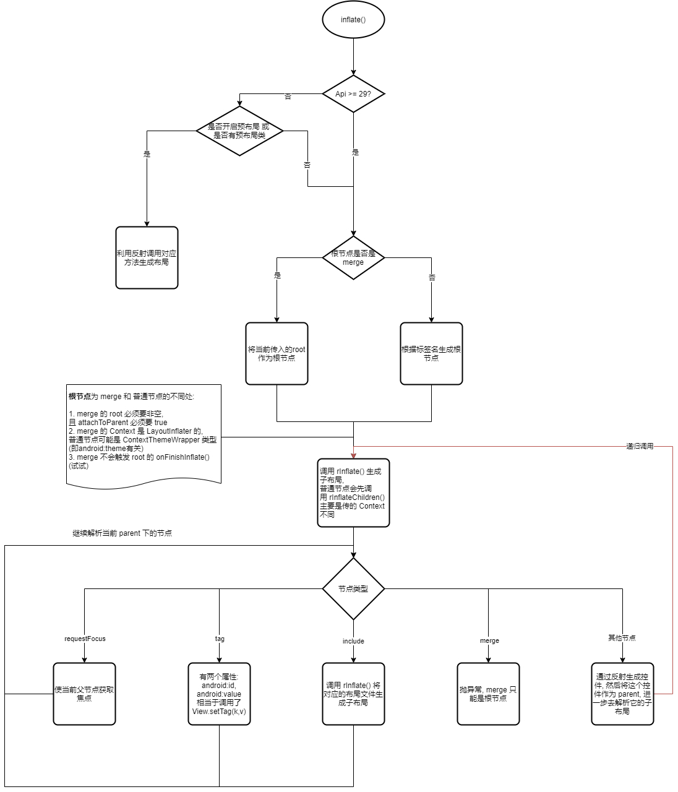
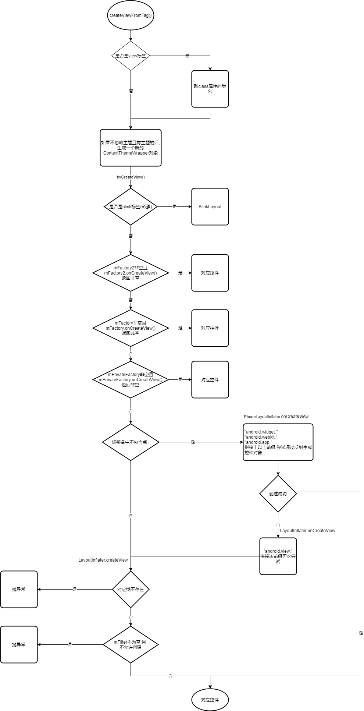

# LayoutInflater

_Android: 30_

___

## Factory, Factory2

`Factory2` 是 `Factory` 的一个扩展, 方法名还是 `onCreateView` 不过多传了一个 parent 过去

只能设置一次, 且必须非空, 如果要重新设置要用 `cloneInContext()` 生成新的 `LayoutInflater` 对象

### 设计模式

1. 装饰器模式, 将多个 Factory 合并
    ```java
    //setFactory类似, 就不复制了
    public void setFactory2(Factory2 factory) {
        if (mFactorySet) {
            //只能设置一次, 无论是 Factory 还是 Factory2
            throw new IllegalStateException("A factory has already been set on this LayoutInflater");
        }
        if (factory == null) {
            //非空
            throw new NullPointerException("Given factory can not be null");
        }
        mFactorySet = true;
        if (mFactory == null) {
            mFactory = mFactory2 = factory;
        } else {
            //装饰器模式合并多个 Factory
            mFactory = mFactory2 = new FactoryMerger(factory, factory, mFactory, mFactory2);
        }
    }

    //装饰器模式 主要实现类
    private static class FactoryMerger implements Factory2 {
        private final Factory mF1, mF2;
        private final Factory2 mF12, mF22;

        FactoryMerger(Factory f1, Factory2 f12, Factory f2, Factory2 f22) {
            mF1 = f1;
            mF2 = f2;
            mF12 = f12;
            mF22 = f22;
        }

        @Nullable
        public View onCreateView(@NonNull String name, @NonNull Context context,
                @NonNull AttributeSet attrs) {
            View v = mF1.onCreateView(name, context, attrs);
            if (v != null) return v;
            return mF2.onCreateView(name, context, attrs);
        }

        @Nullable
        public View onCreateView(@Nullable View parent, @NonNull String name,
                @NonNull Context context, @NonNull AttributeSet attrs) {
            View v = mF12 != null ? mF12.onCreateView(parent, name, context, attrs)
                    : mF1.onCreateView(name, context, attrs);
            if (v != null) return v;
            return mF22 != null ? mF22.onCreateView(parent, name, context, attrs)
                    : mF2.onCreateView(name, context, attrs);
        }
    }
    ```

2. 责任链模式

    ```java
    @Nullable
    public final View tryCreateView(@Nullable View parent, @NonNull String name,
        @NonNull Context context,
        @NonNull AttributeSet attrs) {
        if (name.equals(TAG_1995)) {
            // 彩蛋
            // Let's party like it's 1995!
            return new BlinkLayout(context, attrs);
        }

        View view;
        //责任链模式, 直到有一个能够解析生成当前标签
        if (mFactory2 != null) {
            view = mFactory2.onCreateView(parent, name, context, attrs);
        } else if (mFactory != null) {
            view = mFactory.onCreateView(name, context, attrs);
        } else {
            view = null;
        }

        if (view == null && mPrivateFactory != null) {
            view = mPrivateFactory.onCreateView(parent, name, context, attrs);
        }

        return view;
    }

    ```

### 使用例子

appcompat 包中的 `AppCompatViewInflater`, 在 xml 中设置 `<TextView />`, 运行时生成了 `AppCompatTextView` 类对象

## PrivateFactory

1. Activity
2. android.app.FragmentManager (系统自带的)

用于解析 fragment 标签, 源码就不上了

## Filter

判断是否允许当前标签创建, 例子: 通知, 小部件中的控件需要有 `@RemoteView` 注解, 就是通过 Filter 来过滤

## 解析标签



## createViewFromTag



## PhoneLayoutInflater

`LayoutInflater` 的唯一实现类, 主要是给 **没有 . 的标签**添加前缀, 并尝试创建

前缀有:

1. `android.widget.`
2. `android.webkit.`
3. `android.app.`

## 特殊 Tag

### `merge`:

1. 必须是根节点

2. 调用 `inflate()` 时必须要传入 root 且 attachToRoot == true

### `include`

1. parent 必须是 `ViewGroup` 类型

#### 在 api >= 23 上的改动

1. 支持覆盖被引用布局的 `android:theme`

2. 支持解析 `?attr`, 例如:

    ```xml
    <!-- styles.xml -->
    <style name="IncludeTheme">
        <item name="include_layout">@layout/included_demo</item>
    </style>

    <!-- layout.xml -->
    <include layout="?attr/include_layout" android:theme="@style/IncludeTheme"/>
    ```

#### Layout parameter layout_xxx ignored unless both layout_width and layout_height are also specified on &lt;include&gt; tag

上源码:
```java
private void parseInclude(XmlPullParser parser, Context context, View parent,
            AttributeSet attrs) throws XmlPullParserException, IOException {
    //... 掐头
    //被引用布局的 xml 解析器
    final XmlResourceParser childParser = context.getResources().getLayout(layout);
    //被引用布局的 属性
    final AttributeSet childAttrs = Xml.asAttributeSet(childParser);
    ViewGroup.LayoutParams params = null;
    try {
        //尝试在 <include> 标签中解析 LayoutParams
        params = group.generateLayoutParams(attrs);
    } catch (RuntimeException e) {
        // Ignore, just fail over to child attrs.
    }
    if (params == null) {
        //如果 <include> 标签中解析不到, 那么就去被引用布局去拿
        params = group.generateLayoutParams(childAttrs);
    }
    view.setLayoutParams(params);
    //... 去尾
}
```

见源码可知:

1. 如果 include 标签中设定了 `android:layout_width`, `android:layout_height`, 那么**被引用布局中**的 所有 layout_xxx 属性都被忽略

2. 如果 include 标签中没有设置宽度 && 高度, 那么**在 include 标签中设置的**任意 layout_xxx 属性都被忽略(虽然AS会报错, 但是仍可以编译成功, 所以有些错误不要忽略)

### `blink`

`BlinkLayout` 彩蛋标签, 一闪一闪

### `requestFocus`

会调用 `View.restoreDefaultFocus()` 获取焦点

### `tag`

给当前 parent 设置tag, 相当于调用 `View.setTag(key, value)`

## ContextThemeWrapper

在解析带有 `android:theme` 属性的标签时, 会生成 `ContextThemeWrapper` 对象, 用来生成控件对象, 所以有时在 `View.getContext()` 获取到的不一定是 `Activity` 类型

```java
View createViewFromTag(View parent, String name, Context context, AttributeSet attrs, boolean ignoreThemeAttr) {
    // ...

    if (!ignoreThemeAttr) {
        final TypedArray ta = context.obtainStyledAttributes(attrs, ATTRS_THEME);
        final int themeResId = ta.getResourceId(0, 0);
        if (themeResId != 0) {
            //看这
            context = new ContextThemeWrapper(context, themeResId);
        }
        ta.recycle();
    }

    if (-1 == name.indexOf('.')) {
        //再看这
        view = onCreateView(context, parent, name, attrs);
    } else {
        //再看这
        view = createView(context, name, null, attrs);
    }

    // ...
}
```

## PrecompiledView

api 29, Android 10 开始代码中就有了. 将xml解析成类(应该类似于[android-x2j](https://github.com/7hens/android-x2j), [X2C](https://github.com/iReaderAndroid/X2C)), 来减少IO读取布局时间, 以及避免反射。但是到现在(Android 11, api 30)的release版本都是默认关闭的, 就暂时不去看了

[资料](https://android.googlesource.com/platform/frameworks/base/+/master/startop/view_compiler/README.md)
